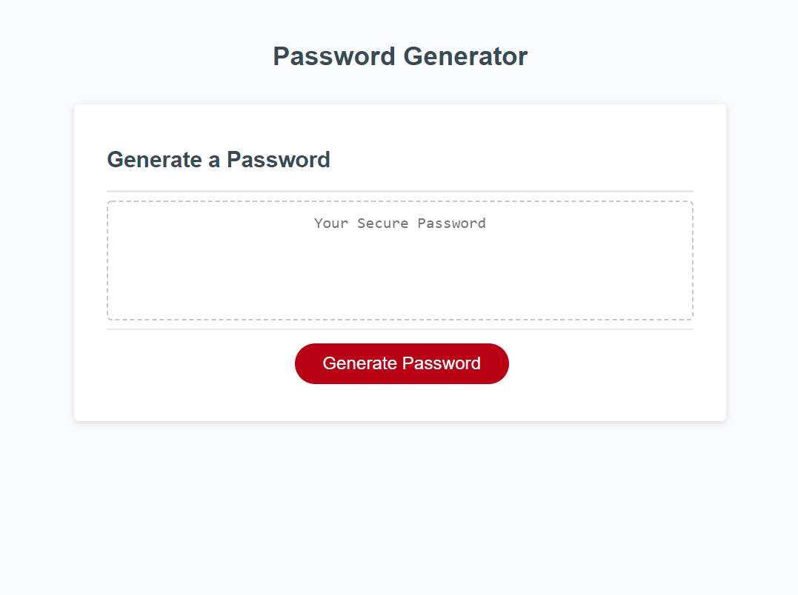

Password Generator
=======
[Link](https://kashane1.github.io/pwgenerator128/)
-----------
Following the link above will bring you to the password generator.

-----------
Requirements:
-----------

1. The password generator will prompt the user to select all the criteria for their password.
2. They can choose a length of at least 8 characters and no more than 128 characters.
3. Next they are asked to choose at least 1 of the 4 character types to include in their password; lowercase, uppercase, numeric, and/or special characters.
4. After all prompts are answered, the website shows the user all the selected criteria and lastly will generate a password
5. The password is then written to the page in the main text box.

-----------
Process:
-----------
As all processes start, I thought out as many steps as I could and started to draw up a basic program both in my head and in code. Having the final project in mind is a clear way of thinking out and writting code. I worked through the whole program almost flawlessy, until one of the last sections that includes the for loop. I had forgotten to use Math.floor() in front of Math.random() I actually had to take a break from the computer and come back with fresh eyes in order to see my error.

-----------
```
preview of the password generator:
```


-----------
Cited:
-----------
https://www.w3schools.com/ - references to html and css

https://developer.mozilla.org/en-US/ - for javascript references

https://favicon.io/ - favicon generator

-----------